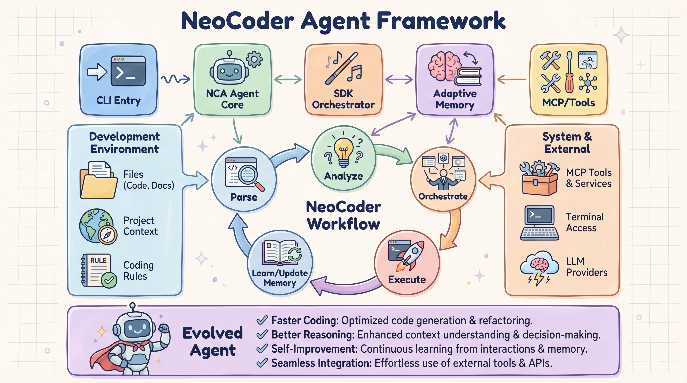
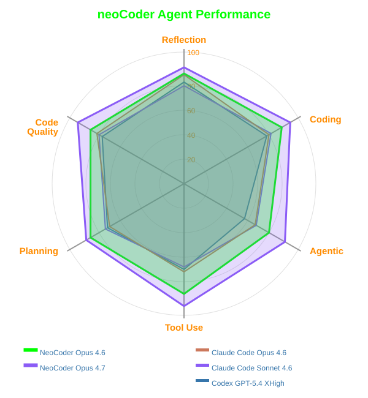
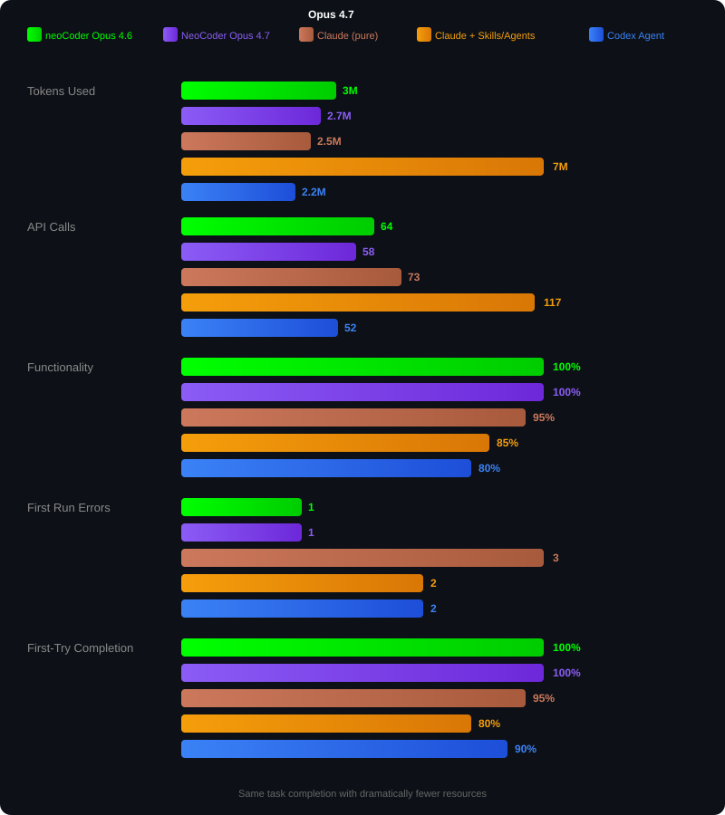
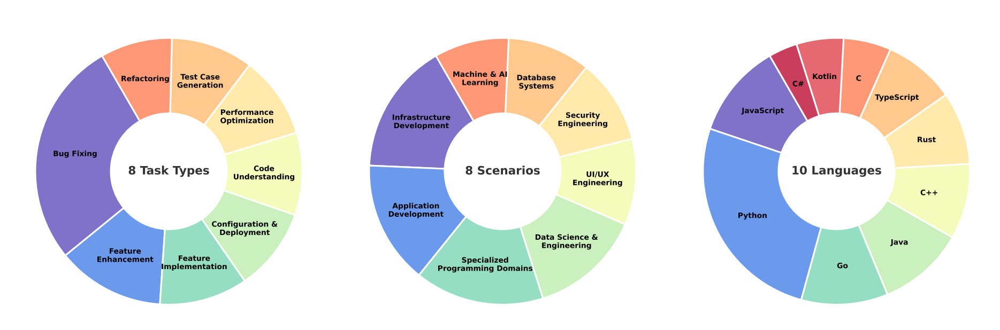
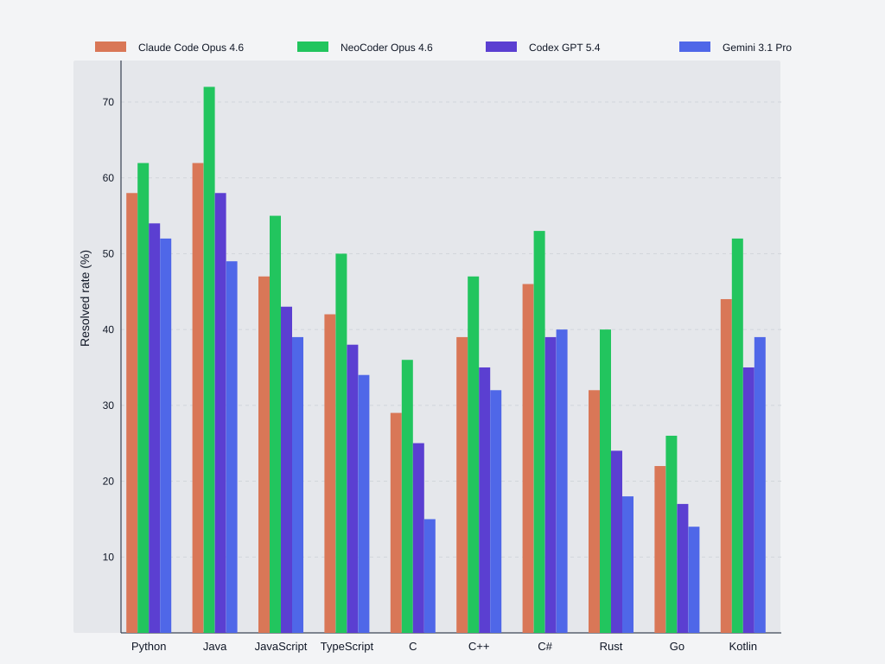
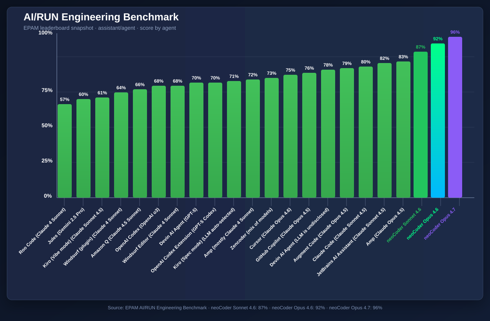
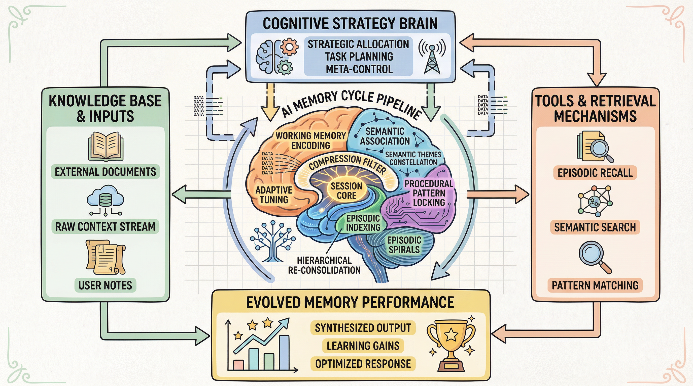
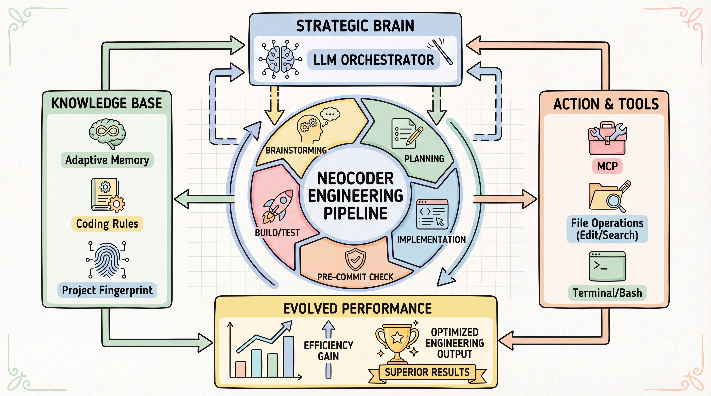

<div align="center">


```
 ███╗   ██╗███████╗ ██████╗    ██████╗ ██████╗ ██████╗ ███████╗██████╗ 
 ████╗  ██║██╔════╝██╔═══██╗  ██╔════╝██╔═══██╗██╔══██╗██╔════╝██╔══██╗
 ██╔██╗ ██║█████╗  ██║   ██║  ██║     ██║   ██║██║  ██║█████╗  ██████╔╝
 ██║╚██╗██║██╔══╝  ██║   ██║  ██║     ██║   ██║██║  ██║██╔══╝  ██╔══██╗
 ██║ ╚████║███████╗╚██████╔╝  ╚██████╗╚██████╔╝██████╔╝███████╗██║  ██║
 ╚═╝  ╚═══╝╚══════╝ ╚═════╝    ╚═════╝ ╚═════╝ ╚═════╝ ╚══════╝╚═╝  ╚═╝
```


[](https://python.org)
[](https://anthropic.com)
[](LICENSE)
[](https://modelcontextprotocol.io)

** AI-Native Engineering Agent for Enterprise-Scale Codebase**

[Installation](#-installation) •
[Quick Start](#-quick-start) •
[Features](#-key-features) •
[Workflow Mode](#-professional-engineering-mode-workflow-preset) •
[Code Review](#-automatic-code-review) •
[Configuration](#%EF%B8%8F-configuration) •
[MCP Server](#-mcp-integration) •
[LiveBench Leaderboard](docs/livebench_leaderboard.md)

</div>

-----





-------

<div align="center">
  
</div>

### ⚡ Efficiency Comparison in [real world COMPLEX task](#real-complex-example):

<div align="center">
  
</div>

### 🤖 SWE-Compass Benchmark

<div align="center">
  
</div>

---

<div align="center">
  
</div>


----


### 🤖 AI/RUN Engineering Benchmark

Source: [EPAM AI/RUN Engineering Benchmark](https://epam.github.io/AIRUN-Engineering-Benchmark/assistant/agent)

<div align="center">
  
</div>

---

## ✨ Key Features

| Feature | Description                                                                      |
|---------|----------------------------------------------------------------------------------|
| 🧠 **Orchestrator** | Core agent loop with iterative reasoning and action execution                    |
| 🔧 **Extensions** | Modular tool system (bash, file editing, code search, file_restore)              |
| 💾 **Memory Management** | multi-layer memory architecture                                                  |
| 🎯 **Multiple Modes** | Coding, debugging, and refactoring modes                                         |
| 🚀 **Workflow Preset** | 8-stage professional engineering pipeline with brainstorming, planning & testing |
| ✅ **Auto Code Review** | Checks anti-patterns, bottlenecks, best practices, pitfalls & security on save   |
| 🖥️ **Cross-Platform** | Full support for Windows, Linux, and macOS                                       |
| 🔌 **MCP Integration** | Use as MCP server in Claude Code                                                 |

---

## 🔌 Supported Providers

neoCoder supports multiple ways to connect to LLM APIs.

### Anthropic
Direct connection to the official Anthropic API.

- Uses the `ANTHROPIC_API_KEY` environment variable
- Suitable for working with Claude models through the official endpoint

### ZenMux
Connection through ZenMux — a unified API gateway that provides access to multiple LLM providers.

- Uses the `ZENMUX_API_KEY` environment variable
- Provides unified access to multiple LLM providers
- Acts as the default provider

### OpenAI
You can also use your own compatible API endpoint.

### Google Vertex AI
You can also use your own compatible API endpoint.


---

## 🧠 Memory System

neoCoder uses a **multi-layer memory architecture** instead of a flat chat history.

### Layers
- **Working Memory** — active session context for the current task
- **Adaptive Memory** — dynamically tunes compression threshold and rolling window based on task type
- **Context Compression** — summarizes older turns when token pressure grows
- **Hierarchical Memory** — persistent cross-session storage of task results and artifacts
- **Episodic Memory** — stores completed tasks as reusable execution episodes
- **Procedural Memory** — learns reusable workflows and successful patterns
- **Notes Storage** — project notes and detailed markdown knowledge
- **xMemory** — hierarchical semantic memory with facts and themes
- **Session Context** — persists tech stack, brainstorming, plan, and progress in `.neoCoder/context.md`
- 


### How it works
1. On task start, neoCoder can retrieve relevant episodes, procedures, notes, and semantic knowledge.
2. During execution, it keeps active context in working memory.
3. When the context grows too large, it compresses older messages into structured summaries.
4. After completion, it stores outcomes in persistent memory and creates reusable episodes.

This architecture makes neoCoder better at:
- long-horizon engineering tasks,
- cross-session continuity,
- token-efficient context management,
- reusing prior project experience,
- structured planning and workflow persistence.


---

## 📦 Installation

> [!NOTE]
> Requires Python 3.10+ and pipx or uv for the recommended global CLI install.

### Recommended: pipx

```bash
pipx install neocoder
```

### Alternative: uv

```bash
uv tool install neocoder
```

### Local development

```bash
# Clone and install
cd neoCoder
pip install -e .

# With development dependencies
pip install -e ".[dev]"

# With MCP server support
pip install -e ".[mcp]"
```

> [!TIP]
> neoCoder loads configuration from `%USERPROFILE%\\.neoCoder\\settings.json` on Windows and `~/.neoCoder/settings.json` on Linux/macOS, so the installed CLI works from any directory.

---


## 🚀 Quick Start

> [!TIP]
> Quick start in 3 steps: install → set API key → run

### 1️⃣ Initialize Configuration

```bash
neocoder \init-config          # Create example configuration
```

### 2️⃣ Set API Key

> [!IMPORTANT]
> API key from Anthropic or ZenMux is required

<details>
<summary><b>🪟 Windows CMD</b></summary>

```cmd
set ANTHROPIC_API_KEY=your-key
set ZENMUX_API_KEY=your-key
```
</details>

<details>
<summary><b>💠 Windows PowerShell</b></summary>

```powershell
$env:ANTHROPIC_API_KEY="your-key"
$env:ZENMUX_API_KEY="your-key"
```
</details>

<details>
<summary><b>🐧 Linux / macOS</b></summary>

```bash
export ANTHROPIC_API_KEY=your-key
export ZENMUX_API_KEY=your-key
```
</details>

### 3️⃣ Run

```bash
# Interactive mode
neocoder

# Single task
neocoder "Create a Python hello world script"

# With options
neocoder --mode debug "Fix test_api.py"
neocoder --preset thorough "Refactor auth module"
```

---

## 💻 Usage

### Basic Commands

| Command | Description |
|---------|-------------|
| `neocoder` | Interactive mode |
| `neocoder "task"` | Execute single task |
| `neocoder --help` | Show help |
| `neocoder \help` | Show system commands |
| `neocoder \version` | Show version |


### ✨ Professional Engineering Mode (Workflow Preset) ✨


The workflow preset is a production-grade, 8-stage development process with brainstorming, detailed planning, testing, and code review - designed for complex engineering tasks.

```bash
neocoder --preset workflow "your complex task"
```

**8-Stage Engineering Pipeline:**

| Stage | Description | Auto-Approve |
|-------|-------------|--------------|
| 1️⃣ **Problem Breakdown** | Decomposes task into subtasks with dependencies | ❌ Requires approval |
| 2️⃣ **Brainstorming** | High-level approach, alternatives, trade-offs, risks | ❌ Requires approval |
| 3️⃣ **Implementation Plan** | Creates detailed step-by-step plan based on brainstorming | ❌ Requires approval |
| 4️⃣ **Implementation** | Executes the plan with file operations | ✅ Auto-proceeds |
| 5️⃣ **Integration Testing** | Runs automated tests with retry logic | ✅ Auto-proceeds |
| 6️⃣ **Tech Stack Review** | Validates against best practices | ✅ Auto-proceeds |
| 7️⃣ **Code Review** | Automated review using project rules | ✅ Auto-proceeds |
| 8️⃣ **Merge Preparation** | Generates commit-ready summary | ✅ Auto-proceeds |

**Key Features:**
- 🔄 **Stateful execution** - Resume interrupted workflows
- 📊 **Extended context** - 16K tokens, 250 iterations
- 🎯 **Deterministic** - Temperature 0.0 for consistency
- 🔍 **Quality gates** - Automatic testing and code review
- 📝 **Conventional commits** - Auto-generated commit messages

**Example Usage:**

```bash
# Start a complex feature
neocoder --preset workflow "Add OAuth2 authentication with JWT tokens"

# Resume if interrupted (state is saved)
neocoder --preset workflow "Add OAuth2 authentication with JWT tokens"
# Prompt: Continue from previous state? (y/n)

# Reset workflow state
neocoder workflow reset
```

<a id="real-complex-example"></a>

### Real Complex Example 
```bash
neocoder "Design a full-stack web application for a cryptocurrency trading bot dashboard.
The application should allow users to monitor their bot's performance in real-time, including current holdings, profit/loss, open trades, and historical performance data visualized through interactive charts.
Users should be able to configure trading parameters, such as risk tolerance, stop-loss levels, and take-profit targets, through an intuitive interface.
The application should feature secure authentication and authorization, protecting user data and trading credentials.
The backend should be built using Node.js with Express.js, utilizing a PostgreSQL database for data persistence.
The frontend should be built using React, with a clean and modern design emphasizing data visualization and ease of use.
The application should include robust error handling and logging capabilities.
The deployment should be considered, suggesting a suitable cloud platform and deployment strategy.
Provide the complete codebase, including frontend, backend, and database schema, ready for deployment.
The application should be named 'LovableBotDashboard'"
```


**When to use Workflow Preset:**
- ✅ Complex features requiring multiple files
- ✅ Refactoring with extensive testing
- ✅ Production-critical changes
- ✅ Team projects with code review requirements
- ❌ Quick fixes or single-file changes (use default mode)

---

### Standard Presets

```bash
# Fast mode - Quick iterations
neocoder --preset fast "Fix the login bug"

# Thorough mode - Extended analysis
neocoder --preset thorough "Refactor auth module"
```

### Workflow Commands

```bash
neocoder --preset workflow "your task"    # Run with workflow preset
neocoder workflow status                   # Check workflow status
neocoder workflow reset                    # Reset workflow state
```

### System Commands

> 💡 Use backslash `\` for system commands

```bash
neocoder \init-config    # Create configuration
neocoder \help           # Show system commands  
neocoder \version        # Show version
```
## 🛡️ File Change Confirmation

Use `--confirm` (`-c`) flag to require manual approval before each file modification:

```bash
neocoder --confirm "create a new module"
neocoder -c "refactor auth system"
```

**Confirmation dialog options:**

| Key | Action |
|-----|--------|
| `y` | Accept changes |
| `n` | Reject changes |
| `e` | Edit in external editor |
| `d` | View full diff |
| `a` | Accept all remaining changes |
| `q` | Abort operation |

---

## 🎨 Command Palette (Interactive Mode)

In interactive mode, use `::` commands for quick actions:

| Command | Action |
|---------|--------|
| `::` | Open command palette with fuzzy search |
| `::m` | Switch mode (coding/debug/refactor) |
| `::t` | Switch or create thread |
| `::s` | Toggle mode (coding ↔ debug) |

**Built-in commands:**

| Command | Action |
|---------|--------|
| `exit` / `quit` / `q` | Exit agent |
| `reset` | Reset current session |
| `help` | Show help |

---


---

## ⚙️ Configuration

Configuration files are stored in `~/.neoCoder/`:

```
~/.neoCoder/
├── 📄 settings.json        # Agent configuration
├── 📄 models.json          # Model definitions
├── 📄 tool_selection.json  # Tool selection settings
└── 📁 notes/               # Persistent notes from sessions
```

### Environment Variables

| Variable | Description |
|----------|-------------|
| `ANTHROPIC_API_KEY` | Official Anthropic API key |
| `ZENMUX_API_KEY` | ZenMux API key (default) |
| `NEOCODER_BASE_URL` | Custom API endpoint |
| `NEOCODER_CONFIG` | Custom config path |

---
### Review Priority Order

| Priority | Check | Description |
|----------|-------|-------------|
| 1️⃣ | **Anti-Patterns** | God Objects, Spaghetti Code, Shotgun Surgery |
| 2️⃣ | **Bottlenecks** | N+1 queries, sync I/O in loops, inefficient operations |
| 3️⃣ | **Best Practices** | Missing docs/JSDoc, mutable defaults, proper comparisons |
| 4️⃣ | **Pitfalls** | Broad exception catching, empty catch blocks, assert misuse |
| 5️⃣ | **Security** | Deserialization, command injection, path traversal, insecure HTTP |

### Additional Checks (all universal)
- 🔒 **Security**: Hardcoded secrets, SQL injection, eval/exec, insecure YAML, debug flags
- 🐛 **Syntax**: Parse errors (Python AST), brace/bracket balance (JS/TS)
- 📊 **Complexity**: Cyclomatic complexity, nesting depth
- 🎨 **Style**: Code duplication, dead code / unused imports
- 🏷️ **Types**: Missing type hints (Python), `any` usage (TypeScript)

**Example Output:**
```
✓ Code Review: Score 85/100, 2 issue(s)
[critical] No Anti-Patterns (line 45): God Object: Class 'UserManager' has 25 methods (>20)
  → Fix: Split into smaller, focused classes (Single Responsibility Principle)
```

**Configuration:**
Code review rules can be customized in `.neoCoder/code_review_config.json`

---

## 🔌 MCP Integration

> [!WARNING]
> MCP server requires separate installation: `pip install -e ".[mcp]"`

Run neoCoder as an MCP server for Claude Code:

```bash
neocoder-mcp
# or
python -m neoCoder.mcp.server
```

### Claude Code Configuration

Add to your Claude Code MCP settings (`claude_desktop_config.json` or via `claude mcp add`):

```json
{
  "mcpServers": {
    "neocoder": {
      "command": "python",
      "args": [
        "-m",
        "neoCoder.mcp.server"
      ],
      "env": {}
    }
  }
}
```

**Or using the CLI:**

```bash
claude mcp add neocoder -- python -m neoCoder.mcp.server
```

**With uv (recommended):**

```bash
claude mcp add neocoder -- uv run --directory /path/to/neoCoder python -m neoCoder.mcp.server
```

---

## 🏗️ Architecture


```


**Made with ❤️ for developers**


